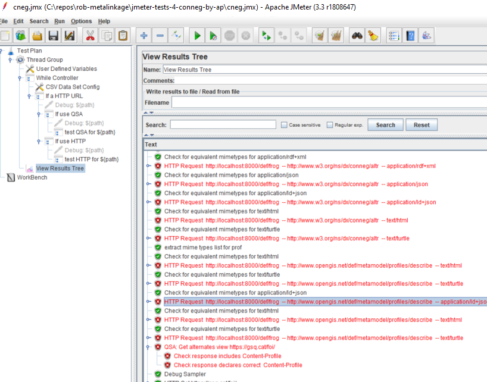

# jmeter-tests-4-conneg-by-ap
An Apache JMeter test for the behaviour of resources implementing "Content negotiation by profile (CNEG-AP)" (https://www.w3.org/TR/dx-prof-conneg/)

CNEG-AP supports the means to list available profiles and the media types they support. 

The validation suite accesses this list per resource identified and checked each profile returns the correct media type - and identifies the profile being matched.

negotiation is checked by use of dummy profiles that are not supported in the Accept-profile list, and by inclusion of multiple supported profiles to ensure the preferred option is returned.

Both HTTP and QSA (query string argument) methods of CNEG-AP are supported.

## status
This will track the emerging draft recommendation.

It is fairly crude - contributions to make it easier to configure and improve reporting are welcome.

## features
* Checks for both HTTP and Query string argument forms for negotiation
* in QSA mode it reads the canonical "all" profile to determine all the combinations to test. It checks that the response declares the correct Content-Profile responss
* in HTTP mode it uses HTTP Link headers accessed via HTTP HEAD requests to determine all combinations
* all combinations of advertised profiles and formats are accessed
* responses are checked for returning correct Mime type only

## usage
Open cneg.jmx in Apache Jmeter and update the user variables to point to a file that lists the resources you wish to check (or edit testtargets.csv). Select "view results" and run suite. By default it will show all results. 

Conformance Failures will show in two modes:
1) assertion failures - resources did not behave as expected
2) HTTP request failures - the advertised resource was not honoured by the server

## possible future improvements (help welcomed)
* optional strict mode to for declaration of returned Content-profile matches request 
* resolve profile URIs and get profile descriptions and validation resources - and check not just conneg function but also conformance of resources
* resolve profile URIs and identify profile hierarchies and check that requests for more general profiles return specific profiles.
* check HTTP and QSA are equivalent
* check QSA overrides HTTP
* look in 303-redirected content for profile identification (needs a canonical encoding)
* QSA-ALT testing

## bugs
please lodge an issue in this repo to report bugs.
